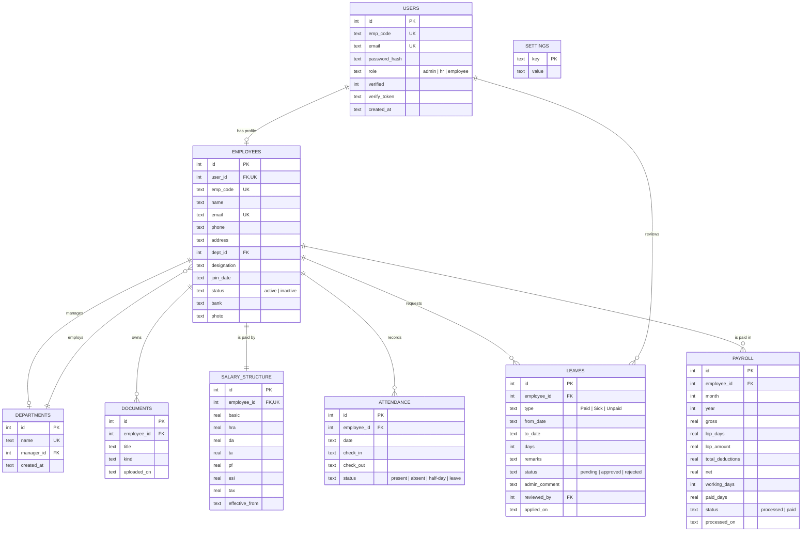

# Entity–Relationship Diagram

Nine tables. `users` holds credentials, `employees` holds the HR record, and the
two are linked one-to-one so authentication stays separable from personnel data.

## Key constraints

| Constraint | Purpose |
|---|---|
| `attendance UNIQUE (employee_id, date)` | One attendance row per person per day |
| `payroll UNIQUE (employee_id, month, year)` | Re-running a month updates rather than duplicates |
| `salary_structure UNIQUE (employee_id)` | Exactly one active structure per employee |
| `users.role CHECK` | Only three valid roles |
| `attendance.status CHECK` | Only the four SRS statuses |
| `leaves.type CHECK` | Only Paid, Sick, Unpaid |
| `departments.manager_id ON DELETE SET NULL` | Removing a manager does not delete the department |
| `employees.dept_id ON DELETE SET NULL` | Employees survive a department being removed |
