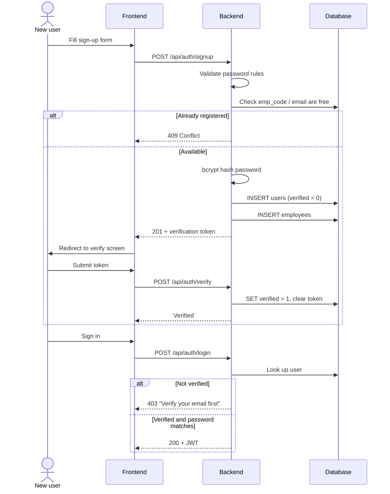
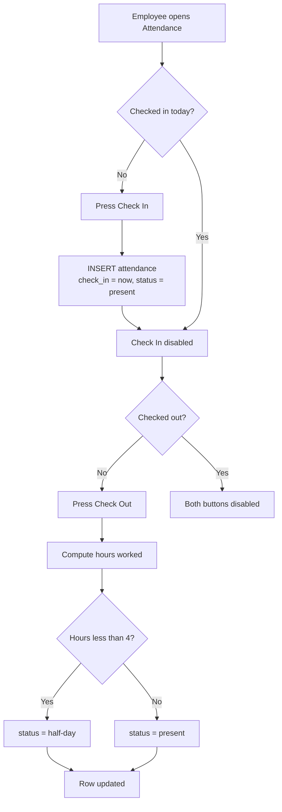
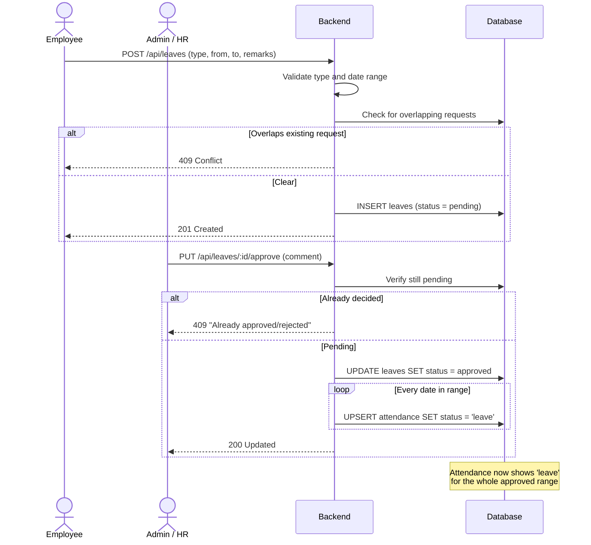
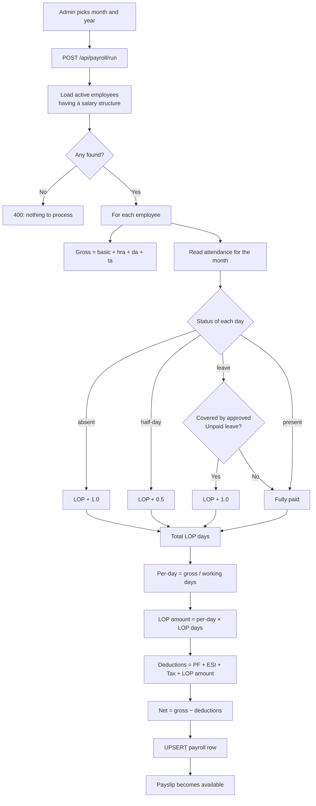

# Process Flows

The four multi-step processes in Dayflow, as they are actually implemented.

---

## 1. Registration and email verification

> This build has no SMTP server, so the token is returned in the response and the
> app hands the user to the verification screen. In production the token would
> arrive as an emailed link.

---

## 2. Attendance check-in and check-out

Guards: a second check-in returns `409 Already checked in today at HH:MM:SS`, and
checking out without checking in returns `409 You have not checked in today`.

---

## 3. Leave approval, with write-through to attendance

This is the process SRS 3.5.2 describes as *"changes reflect immediately in
employee records"*.

---

## 4. Monthly payroll processing

Payroll is prorated against attendance. This is what makes the run meaningful
rather than a fixed multiplication.

### Worked example

Abubakkar Siddiq, July 2026 — 22 working days, 2 days lost:

| Line | Amount |
|---|---:|
| Basic | ₹42,000 |
| HRA | ₹16,800 |
| DA | ₹8,400 |
| TA | ₹4,200 |
| **Gross** | **₹71,400** |
| PF | −₹5,040 |
| ESI | −₹840 |
| Income Tax | −₹4,800 |
| Loss of Pay (2 days @ ₹3,245.45) | −₹6,491 |
| **Total deductions** | **−₹17,171** |
| **Net take-home** | **₹54,229** |

Per-day rate = 71,400 ÷ 22 = ₹3,245.45. Two days lost = ₹6,491 (rounded).
