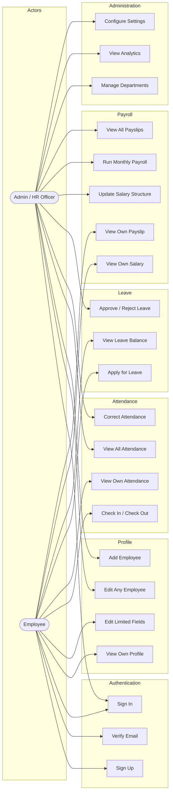

# Use Case Diagram

Two actor classes, per SRS section 2: **Admin / HR Officer** and **Employee**.

## Permission matrix

| Use case | Admin | HR Officer | Employee |
|---|:---:|:---:|:---:|
| Sign up / verify email | — | — | ✅ |
| Sign in | ✅ | ✅ | ✅ |
| View own profile | ✅ | ✅ | ✅ |
| Edit phone / address / photo | ✅ | ✅ | ✅ |
| Edit any employee field | ✅ | ✅ | ❌ |
| Add employee | ✅ | ✅ | ❌ |
| Check in / check out | ✅ | ✅ | ✅ |
| View own attendance | ✅ | ✅ | ✅ |
| View all attendance | ✅ | ✅ | ❌ |
| Correct attendance status | ✅ | ✅ | ❌ |
| Apply for leave | ✅ | ✅ | ✅ |
| Approve / reject leave | ✅ | ✅ | ❌ |
| View own salary and payslip | ✅ | ✅ | ✅ |
| Update salary structure | ✅ | ✅ | ❌ |
| Run monthly payroll | ✅ | ✅ | ❌ |
| View all payslips | ✅ | ✅ | ❌ |
| Manage departments | ✅ | ✅ | ❌ |
| View analytics | ✅ | ✅ | ❌ |
| Configure settings | ✅ | ✅ | ❌ |
